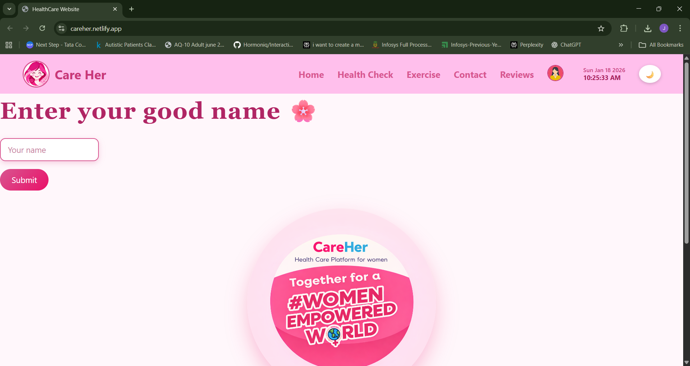

# 🌸 CareHer – HealthCare Platform for Women

Welcome to **CareHer**!  
CareHer is a responsive women-focused healthcare website built using **HTML, CSS, JavaScript, and Node.js**, designed to promote menstrual health awareness, cycle tracking, and overall wellness through a soft and user-friendly interface — with exercise guidance, diet plans, and chatbot integration.

🌐 **Live Website:** https://careher.netlify.app/

---

## 🚀 Features

- **Navigation Bar & Footer** – Smooth navigation across all pages
- **Home Page** – Introduction to CareHer and its mission
- **Period / Cycle Tracker** – Calculate menstrual cycle details
- **Diet & Health Guidance** – Helpful tips for irregular periods
- **Chatbot Support** – Friendly chatbot for quick assistance
- **BMI Calculator** – Calculate Body Mass Index with product recommendations
- **PCOD / PCOS Risk Assessment** – Quiz-based symptom checker
- **Doctor Appointment Booking** – Book appointments with specialists
- **User Auth (Signup / Login)** – Backend-connected user management
- **Reviews System** – Submit and manage multiple user reviews
- **Modern UI Design** – Soft pink theme focused on women's wellness
- **Responsive Design** – Works on desktop, tablet, and mobile

---

## 📄 Pages Included

| Page Name             | File Name                  | Description                                              |
|-----------------------|----------------------------|----------------------------------------------------------|
| Home                  | `index.html`               | Welcome page and main navigation                         |
| Health Check          | `healthcheck.html`         | Central health tools section                             |
| BMI Calculator        | `bmi-calc.html`            | Calculates Body Mass Index using height and weight       |
| Period Tracker        | `period.html`              | Tracks menstrual cycle and predicts next period          |
| PCOD / PCOS Detection | `p.html`                   | Helps assess PCOD/PCOS symptoms using user inputs        |
| PCOD Risk Quiz        | `pcod-risk.html`           | Quiz-based PCOD risk assessment                          |
| PCOS Risk Quiz        | `pcos-risk.html`           | Quiz-based PCOS risk assessment                          |
| Exercise              | `exercise.html`            | Workout and fitness guidance for women                   |
| Appointment           | `appointment.html`         | Book doctor appointments                                 |
| Reviews               | `review.html`              | User feedback and testimonials                           |
| Contact               | `contact.html`             | Contact details and support information                  |
| Login / Signup        | `signup.html`, `login.html`| User login and registration                              |

---

## 🛠️ Tech Stack

- **HTML** – Structure of the website
- **CSS** – Styling and responsive layout
- **JavaScript** – Interactivity and health calculations
- **Node.js + Express** – Backend REST API
- **JSON File Storage** – Lightweight data persistence (users, reviews, appointments)

---

## 🔌 Backend API

| Method | Endpoint               | Description              |
|--------|------------------------|--------------------------|
| POST   | `/api/signup`          | Register a new user      |
| POST   | `/api/login`           | Login existing user      |
| GET    | `/api/reviews`         | Fetch all reviews        |
| POST   | `/api/reviews`         | Submit a new review      |
| DELETE | `/api/reviews/:id`     | Delete a review          |
| GET    | `/api/appointments`    | Fetch all appointments   |
| POST   | `/api/appointments`    | Book a new appointment   |
| DELETE | `/api/appointments/:id`| Delete an appointment    |

---

## 🚀 How to Run

### Frontend only
1. Clone the repository
2. Open `index.html` in your browser

### With Backend
1. Clone the repository
2. Navigate to the backend folder:
   ```bash
   cd backend
   npm install
   npm start
   ```
3. Open `http://localhost:3000` in your browser

---

## 📷 Screenshots

### Home Page


---

## 🔧 Recent Fixes

- Connected backend API (Node.js + Express) for signup, login, reviews, appointments
- All frontend JS falls back to localStorage if backend is offline
- Fixed hardcoded absolute file paths in PCOD/PCOS navigation functions
- Fixed login crash when no user is registered (null reference guard)
- Fixed reviews overwriting — now stores multiple reviews as an array
- Fixed appointments overwriting — now stores multiple appointments as an array
- Fixed logout not clearing session state
- Removed all debug `console.log` statements from production code
